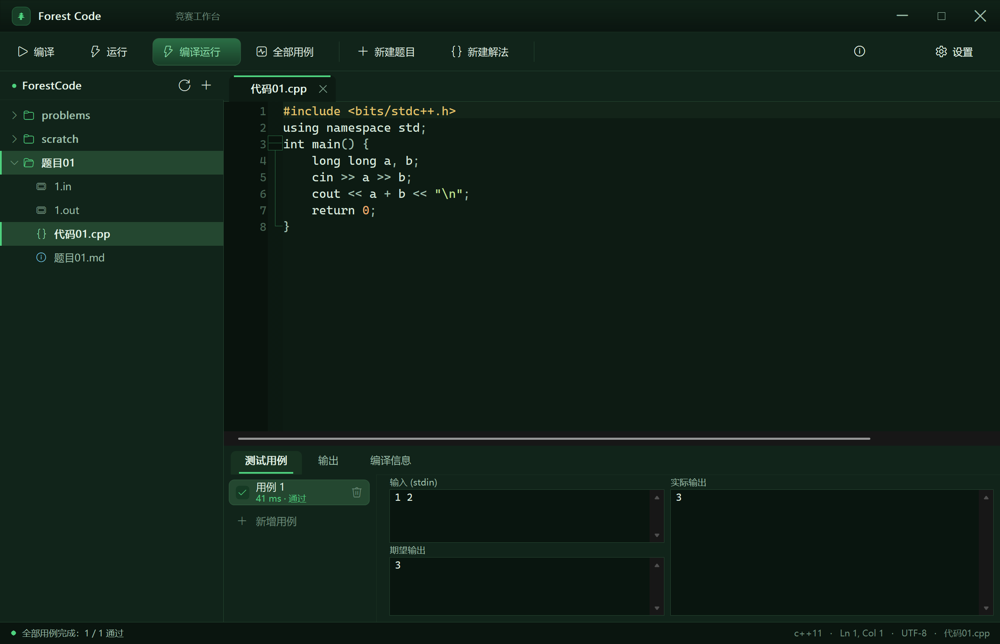

# Forest Code · 竞赛工作台

> 一个为算法竞赛选手手写的**超轻量 C++ IDE**。原生 Win32，17 MB 内存，双击即开。



---

## 为什么会有它

用 Dev-C++：补全弱、界面丑。用 VS：太重、启动慢、后台吃内存。
竞赛选手真正需要的其实很窄：**写代码 → 编译 → 跑样例 → 对拍**，外加**题目和多种解法的管理**。

Forest Code 只做这件事，并且把它做舒服。

- **启动快**：原生 C++ 直接编译成单个 exe，无 Electron / 无 WebView / 无运行时依赖
- **占用低**：实测常驻内存 **约 18 MB**（VS Code 同场景通常 300 MB+）
- **不占后台**：关窗即退出，没有守护进程

---

## 功能

### 编辑
- Scintilla 编辑器内核，C++ 语法高亮、代码折叠、行号、缩进参考线、当前行高亮、括号匹配
- **代码补全**：C++ 关键字 / STL 容器与算法 / 内置竞赛片段 / 当前文件词，输入即弹（可 `Ctrl+Space` 手动唤出）
- **片段库**：输入 `fori`、`dsu`、`dijkstra`、`segtree`、`fastio` 等触发词自动展开成完整代码
- 拖拽文件到窗口即可打开，支持命令行传文件路径

### 文件管理：文件系统就是应用（Obsidian 式）

工作区就是一个**普通文件夹**，侧栏显示它的**完整目录树**。不导入、不锁格式、没有私有数据库。

```
<工作区>/                          ← 你随便建，随便分类
  题目01/                          ← 点一下 ＋ 自动生成
    题目01.md                      ← 题面（空文件）
    代码01.cpp                     ← 代码（空文件，建完立刻打开，直接开写）
    1.in  1.out                    ← 拖进来就自动配对成测试用例
    2.in  2.out
    直接相加.cpp                    ← 再加一个 .cpp 就是一题多解
  洛谷/P1638 逛画展/               ← 你自己的分类方式也行
  scratch/                         ← 随手草稿
```

**约定优于配置**：应用靠"约定"识别，不靠固定结构——

| 约定 | 效果 |
|---|---|
| 目录里有 `.cpp` | 就是可编译的代码 |
| 同目录有多个 `.cpp` | 就是一题多解 |
| 同目录有 `X.in` + `X.out` | 自动配对成一组测试用例 |
| 有 `.md` | 就是题面，点开看 |

所以**改任何名字都不影响功能**：`代码01.cpp` 改成 `直接相加.cpp`、`题目01` 改成 `P1638 逛画展`，照样能编译、能对拍。

**＋ 一键新建题目**：点侧栏的 ＋ → 自动建 `题目NN/` + `题目NN.md` + `代码NN.cpp`，并**立刻打开 .cpp、光标就位**，直接开始敲。零弹窗、零确认。

**双向实时同步**：在资源管理器里新建/改名/删除，应用内一秒内自己更新；应用内操作，磁盘立刻变。没有"刷新"这个动作。

**其他**：双击文件名就地改名（`F2` 同效）· 右键新建文件/文件夹/删除/在资源管理器打开 · 从资源管理器**拖文件到文件夹行上就复制进去** · 自然排序（`题目2` 排在 `题目10` 前）

### 测试用例与对拍
- 多组用例集中管理，输入 / 期望输出 / 实际输出三栏对照
- **F6 一键跑全部用例**，逐条给出 `通过 / 答案错误 / 超时` 与耗时
- 从剪贴板粘贴输入、自动保存用例到磁盘
- 超时自动 kill 进程树（Job Object），不会留下僵尸进程

### 运行
- 编译错误逐条解析，在编辑器里标红出错行
- 编译日志 / 运行输出分标签页查看
- 可配置 C++ 标准（c++11/14/17/20）、编译选项、时间限制、编译器路径

---

## 快捷键

| 键 | 作用 |
|---|---|
| `F11` | 编译并运行（最常用） |
| `F9` | 仅编译 |
| `F5` | 仅运行（不重新编译） |
| `F6` | 运行全部测试用例 |
| `Ctrl+S` / `Ctrl+Shift+S` | 保存 / 全部保存 |
| `Ctrl+Space` | 手动唤出补全 |
| `Ctrl+N` / 侧栏 ＋ | 一键新建题目（题面 + 代码，直接开写） |
| `F2` | 重命名选中的文件/文件夹 |
| `Ctrl+Shift+T` | 新增测试用例 |
| `Ctrl+B` | 收起 / 展开底部面板 |
| `Ctrl+ +/-` | 编辑器字号缩放 |
| `Ctrl+Tab` | 切换标签页 |
| `F1` | 关于 |

---

## 构建

只需要 **MinGW g++ 9+**（GCC 13 已验证）和 PowerShell。

```powershell
# 首次构建会自动下载 Scintilla 566 + Lexilla 553 源码到 third_party/
powershell -File build.ps1

# 指定自己的 g++
powershell -File build.ps1 -GXX "C:\msys64\mingw64\bin\g++.exe"

# 清理重建
powershell -File build.ps1 -Clean

# 构建并启动
powershell -File build.ps1 -Run
```

产物：`build\forest-code.exe`（约 2.3 MB，静态链接，可单独拷走）。

### 桌面快捷方式

```powershell
powershell -File tools\install_shortcut.ps1
```

会在桌面创建带图标的 `Forest Code` 快捷方式（图标已嵌进 exe，任务栏 / Alt+Tab 同样生效）。

### 图标

`res\forestcode.ico` 由 `tools\make_icon.ps1` 用 GDI+ 程序化生成（16~256 共 9 个尺寸）：

```powershell
powershell -File tools\make_icon.ps1 -Preview   # 顺便输出尺寸预览图
```

---

## 代码结构（改哪里）

| 文件 | 职责 |
|---|---|
| `src/theme.h/.cpp` | **配色 / 度量 / 字体 / 绘图辅助**，想换主题改这里 |
| `src/app.h/.cpp` | 主窗口：自定义无边框标题栏、布局、自绘工具栏 / 侧栏 / 标签栏 / 状态栏 |
| `src/commands.cpp` | 全部命令与鼠标键盘交互：编译运行、题目增删、用例管理、分栏拖拽 |
| `src/dialogs.cpp` | 自绘表单对话框（设置、新建题目） |
| `src/editor.h/.cpp` | Scintilla 封装：主题化、补全引擎、片段展开、错误标记 |
| `src/runner.h/.cpp` | 编译 / 运行引擎：管道捕获、超时 kill、Job Object 隔离 |
| `src/workspace.h/.cpp` | 工作区 / 题目模型、设置持久化、内置片段库、编译诊断解析 |
| `src/util.h/.cpp` | UTF-8/UTF-16、路径、INI、剪贴板等基础工具 |
| `tools/shot.ps1` | 开发期窗口截图工具（用于视觉验收） |

---

## 技术选型

- **界面**：纯 Win32 + GDI/GDI+ 自绘，Per-Monitor V2 高 DPI 适配，无第三方 UI 框架
- **编辑器**：静态链接 [Scintilla](https://www.scintilla.org/) 566 + [Lexilla](https://www.scintilla.org/LexillaDoc.html) 553（HPND 许可）
- **编译器**：任意 g++，通过 `CreateProcess` 调用，stdout/stderr 用管道异步捕获
- **无外部依赖**：不依赖 .NET / WebView2 / Electron / Python

配色以深绿 `#0A150F` 为底、薄荷绿 `#4ED17E` 为强调色，长时间盯屏幕不刺眼。

---

## License

MIT。Scintilla / Lexilla 遵循各自的 HPND 许可。
